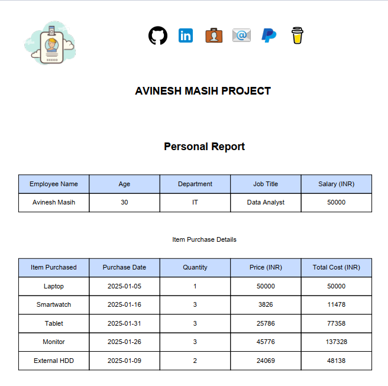

# Automated Employee Report Generation System
---
Welcome to the **Automated Employee Report Generation System** , a repository containing code and resources to automate the process of generating detailed employee reports from Excel data. This project leverages Python and the pandas library to read and process employee data, and the FPDF library to create professional PDF reports.

---

## Project Description

This project provides a streamlined way to read data from an Excel file and load it into a pandas DataFrame. It supports single or multi-sheet Excel files and allows for additional customization, such as selecting specific sheets, columns, or rows. The resulting DataFrame is ready for analysis, transformation, or export, making it a versatile tool for data processing workflows.

**The main features of this project include:**

- **Reading Excel Data:** Efficiently read employee data and purchase details from an Excel file.
- **Data Processing:** Process and organize the data into meaningful reports.
- **PDF Report Generation:** Automatically generate PDF reports for each employee, including personal details and purchase information.
- **Folder Management:** Create individual folders for each employee to store their respective reports.
- **User Interaction:** Prompt the user to overwrite existing reports or skip report generation for specific employees.

---
## Cloning the Repository

**To clone the repository, follow these steps:**

- Open your terminal or command prompt.

- Navigate to the directory where you want to clone the repository.

- Run the following command:
```
git clone https://github.com/avinesh-masih/employee-report-generator.git
```
- Navigate into the cloned repository:
```
cd employee-report-generator
```

## Required Python Libraries:
Install the necessary Python libraries used in this script. 
You can do this by running the following commands in your terminal or command prompt:
```
pip install pandas
pip install fpdf
pip install openpyxl
```
---

## Usage

- **Prepare the Excel File:** Ensure your Excel file contains the necessary sheets with employee data and purchase details.
- **Run the Script:** Execute the generate_employee_reports.py script to generate the reports.
- **Review the Reports:** Check the reports folder for the generated PDF reports for each employee.

---

## Example:

**Here is an example of how to use the script:**

- Place your Excel file (e.g., employees.xlsx) in the assets folder.
- Run the script:

```
python generate_employee_reports.py
```

- Follow the prompts to overwrite or skip existing reports as needed.

---

## Screenshots

**Generated Reports**



**Overwrite Prompt**


**Report Folder**


---

## Project Structure

- `generate_employee_reports.py` : Main script for reading Excel data and generating PDF reports.
- `assets/` : Folder containing the Excel file and other assets like the company logo.
- `reports/` : Folder where the generated PDF reports will be saved.

---

## Contributing

Contributions are welcome! If you have any suggestions or improvements, feel free to create a pull request or open an issue.

---

## License
This project is licensed under the [MIT License](LICENSE).  

**Author:** [@avinesh-masih](https://github.com/avinesh-masih)

---

### Contribution & Usage Terms
By accessing this repository, you agree to the following conditions:  
- You may **view, study, and contribute** only with **prior approval** from the repository owner.  
- You may **not copy, redistribute, or use** any part of this repository for personal, academic, or commercial purposes without authorization.  

For permissions, please contact **[@avinesh-masih](#contact)**.

## Disclaimer 

This code is provided as is, without warranty of any kind, express or implied, including but not limited to the warranties of merchantability or fitness for a particular purpose. The author shall not be held liable for any damages or consequences resulting from the use or misuse of this repository.

## Contact

For inquiries, permissions, or to contribute, please reach out via:  

[](https://www.linkedin.com/in/avineshlko/)  [](https://avinesh-masih.github.io/)  [](mailto:skmasih11@gmail.com)  [](https://paypal.me/AVINESHMASIH)  [](https://buymeacoffee.com/avineshlko)
